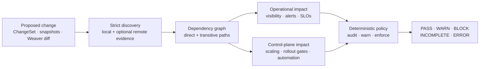

# Telemetry Change Guard

<p align="center">
  <strong>Stop telemetry contract changes from silently breaking production.</strong>
</p>

<p align="center">
  <a href="https://github.com/tadurisaikiran/telemetry-change-guard/actions/workflows/ci.yml"></a>
  <a href="https://github.com/tadurisaikiran/telemetry-change-guard/actions/workflows/e2e.yml"></a>
  <a href="LICENSE"></a>
  
  
</p>

<p align="center">
  <a href="#quick-start">Quick start</a> ·
  <a href="#what-telemetry-change-guard-protects">Coverage</a> ·
  <a href="#github-action">GitHub Action</a> ·
  <a href="#trust-and-safety-model">Trust model</a> ·
  <a href="#documentation">Documentation</a>
</p>

A metric, label, or trace attribute is an operational API. Dashboards visualize
it. Alerts page on it. SLOs calculate against it. Autoscalers and deployment
gates can use it to control production.

Renaming that API may take one line of code while breaking consumers spread
across repositories and systems. The application can compile, its tests can
pass, and the deployment can succeed before anyone notices the blind spot.
That gap grows as human and AI coding agents change instrumentation faster
than engineers can manually trace every downstream dependency.

**Telemetry Change Guard (TCG) evaluates the downstream impact before merge or
deployment.** Given a deterministic description of the proposed telemetry
change, it discovers configured consumers, builds a provenance-bearing
dependency graph, classifies operational risk, and applies explicit policy to
produce one reproducible decision:

**PASS · WARN · BLOCK · INCOMPLETE · ERROR**



TCG is local-first, open source, and useful without AI, a database, or a hosted
service. Optional remote evidence and AI assistance are isolated behind
explicit, bounded interfaces; neither can override the deterministic result.

## See what it catches

The repository includes runnable scenarios that exercise different parts of
the product, not just one adapter:

| Scenario | Proposed change | Dependency TCG proves | Result |
| --- | --- | --- | --- |
| [Observability migration](examples/checkout-migration) | Rename a Prometheus metric and label | Grafana panels, a Sloth SLO, a recording rule, and a transitive alert | `INCOMPLETE`: 7 findings, including blocking alert/SLO risk, plus one unresolved dashboard query |
| [KEDA autoscaling](examples/keda) | Remove a Prometheus metric | Production `ScaledObject` trigger | `BLOCK` with `SCALING_RISK` |
| [Argo Rollouts](examples/argo-rollouts) | Remove a Prometheus metric | `AnalysisTemplate` success-rate measurement | `BLOCK` with `DEPLOYMENT_GATE_RISK` |
| [Kubernetes HPA](examples/hpa) | Remove an external metric | Explicitly mapped `autoscaling/v2` HPA dependency | `BLOCK` with `SCALING_RISK` |
| [Snapshot detection](examples/snapshot-diff) | Compare baseline and candidate Prometheus contracts | Removed metrics and labels become an actionable ChangeSet | Deterministic full diff plus safety evaluation |

The observability fixture demonstrates why graph analysis matters. TCG follows
the full path instead of stopping at the first file:

```text
checkout_request_duration_seconds_bucket
  -> recording rule: checkout:p95_latency
  -> alert rule: CheckoutLatencyHigh
  -> ALERTING_RISK
```

When evidence is malformed or unresolved, TCG keeps every confirmed finding
and returns `INCOMPLETE`. It never turns an incomplete graph into a clean pass.

## Quick start

TCG currently requires Go 1.27 or newer and is built from source while the
first verified pre-release is prepared:

```bash
git clone https://github.com/tadurisaikiran/telemetry-change-guard.git
cd telemetry-change-guard
mkdir -p ./bin
go build -o ./bin/telemetry-change-guard ./cmd/telemetry-change-guard
```

Validate a proposed ChangeSet, then run the KEDA example:

```bash
./bin/telemetry-change-guard validate \
  --changes ./examples/keda/changes.yaml

./bin/telemetry-change-guard check \
  --config ./examples/keda/tcg.yaml \
  --changes ./examples/keda/changes.yaml
```

Validation exits `0`. The check intentionally exits `2` and reports:

```text
Status:    BLOCK
Findings:  1

[BLOCK] SCALING_RISK — orders-worker
  Change:      remove-checkout-requests
  Consumer:    ... (autoscaler)
  Criticality: critical
  Source:      examples/keda/scaledobject.yaml:14

STATUS: BLOCK
```

To evaluate a repository, create a strict `tcg/v1alpha1` configuration that
points to its operational artifacts:

```yaml
apiVersion: tcg/v1alpha1
kind: Config
sources:
  prometheusRules:
    - path: ./monitoring/*.yaml
      required: true
  grafana:
    - path: ./dashboards/*.json
      required: true
  sloth:
    - path: ./slos/*.yaml
      required: true
  keda:
    - path: ./deploy/scaledobjects/*.yaml
      required: true
analysis:
  includeTransitiveDependencies: true
  unresolvedReferencePolicy: error
policy:
  failOnCriticalLegacyConsumer: true
  failOnCriticalUnknown: true
  minimumBlockingCriticality: high
output:
  formats: [console, json, markdown]
```

Start with only the sources your repository owns, mark evidence required when
its absence must stop the decision, and use the
[configuration guide](docs/CONFIGURATION.md) for the complete schema.

## What Telemetry Change Guard protects

TCG separates four questions: what changed, what consumes it, what the impact
is, and whether policy permits it. That separation makes the result auditable
and lets new evidence adapters improve coverage without becoming decision
makers.

### Change sources and contracts

Every supported source normalizes to the same strict
[`tcg/v1alpha1` ChangeSet](docs/CHANGESET.md) before analysis.

| Capability | Implemented behavior |
| --- | --- |
| Explicit changes | Metric and label rename/removal in Prometheus; span and resource attribute rename/removal in OpenTelemetry or Tempo |
| Prometheus snapshots | Bounded, byte-stable metadata/series capture; baseline/candidate comparison; full versioned diff; removed metrics and labels become changes |
| OpenTelemetry Weaver | Structured V1/V2 registry-diff import with mandatory explicit Prometheus mappings or documented ignore decisions |
| Planned migrations | Legacy migration plans normalize into the generic model while preserving the existing readiness result contract |
| Strict input handling | Unknown fields, extra documents, unsupported kinds, invalid endpoints, oversized input, and ambiguous required semantics fail explicitly |

Snapshot additions remain visible but are not treated as breaking changes.
Metric type or unit drift is reported as required uncertainty until the
ChangeSet model can represent it without guessing. See
[change sources and snapshots](docs/CHANGE_SOURCES.md) and the
[migration model](docs/MIGRATION_MODEL.md).

### Consumers and evidence

| Source | What TCG discovers | Evidence behavior |
| --- | --- | --- |
| Prometheus rules and `PrometheusRule` CRDs | Alert and recording rules | Official PromQL AST; recording-rule outputs create transitive graph edges |
| Grafana dashboard JSON | Prometheus panel queries | Nested panels and API envelopes; unresolved templates stay visible |
| Sloth and Pyrra | SLO indicator queries | Critical SLO dependencies, parsed as PromQL |
| KEDA | Prometheus triggers in `ScaledObject` resources | Autoscaler consumers and production-aware `SCALING_RISK` |
| Argo Rollouts | Prometheus measurements in `AnalysisTemplate` and `ClusterAnalysisTemplate` resources | Deployment-gate consumers; only AST-proven label-value argument substitution is accepted |
| Kubernetes HPA | External, object, and pods metrics in `autoscaling/v2` resources | Requires an explicit Kubernetes-to-Prometheus metric and selector-label mapping; same-name inference is forbidden |
| Runtime query history | Prometheus query-log JSONL and a versioned provider-neutral history format | Deterministic aggregation and observation windows; absence never proves non-use |
| Perses metrics-usage | Dashboard, alert-rule, recording-rule, partial, and pending usage | Optional bounded HTTP evidence; imported expressions are parsed again locally |
| Tempo and TraceQL | Strict local trace-query inventories | Tempo validates syntax; scoped span/resource attributes require explicit OpenTelemetry mappings |
| Ownership metadata | Explicit repository metadata, GitHub CODEOWNERS, and Grafana `team:`/`owner:` tags | Advisory owner enrichment with provenance; never changes status |

Local sources require no network. Perses and Tempo are opt-in, read-only remote
adapters with response limits, timeouts, same-origin redirect checks, and
environment-variable credential references. Adapter failures and partial
evidence remain diagnostics; a failed required source cannot produce `PASS` or
`READY`. The [adapter catalog](docs/ADAPTERS.md) documents exact boundaries.

### Graph, impact, and policy

| Capability | What it provides |
| --- | --- |
| Formal query analysis | Prometheus's official PromQL parser for selectors, matchers, aggregations, vector matching, and label functions; Tempo parser validation for TraceQL |
| Dependency graph | Direct and cycle-safe transitive paths through produced symbols such as recording rules |
| Operational taxonomy | `VISIBILITY_LOSS`, `ALERTING_RISK`, `SLO_RISK`, `SCALING_RISK`, `DEPLOYMENT_GATE_RISK`, `AUTOMATION_RISK`, and `SEMANTIC_RISK` |
| Immutable findings | Change, consumer, criticality, source location, references, provenance, and dependency paths are retained before policy runs |
| Rollout modes | `audit`, `warn`, and `enforce` change handling without deleting or hiding findings |
| Fail-closed precedence | `ERROR` → `INCOMPLETE` → `BLOCK` → `WARN` → `PASS`; known findings survive higher-precedence uncertainty or errors |
| Machine contract | Versioned `tcg-result/v1alpha1` JSON with stable status and exit-code semantics |

The default enforcement policy warns on visibility and semantic findings and
blocks high/critical alerting, SLO, scaling, deployment-gate, and automation
risk. Teams can stage adoption with rollout modes and criticality thresholds
without losing evidence. See the [generic safety engine](docs/SAFETY_ENGINE.md).

### CLI and automation

The canonical executable is `telemetry-change-guard`. Its main workflows are:

```text
telemetry-change-guard validate          validate ChangeSets or snapshots
telemetry-change-guard snapshot          capture a bounded Prometheus contract
telemetry-change-guard diff              compare baseline/candidate snapshots
telemetry-change-guard check             make an authoritative safety decision
telemetry-change-guard impact            explain paths from one Prometheus metric
telemetry-change-guard graph             export the complete dependency graph
telemetry-change-guard migration check   evaluate planned cutover readiness
telemetry-change-guard migration advise  request a bounded optional AI explanation
telemetry-change-guard migration remediate validate an in-memory candidate fix
```

Reports are available as console, Markdown, versioned JSON, and graph JSON.
One evaluation can also write companion JSON and authoritative status files,
so integrations never need to rediscover remote evidence or infer a status
from prose. The [CLI reference](docs/CLI.md) covers every flag and exit code.

The temporary `tmr` compatibility executable and `tmr/v1alpha1`
configuration remain supported. They share the canonical command
implementation; equivalent migration checks produce byte-for-byte identical
legacy reports and the same `READY`/`BLOCKED`/`INCOMPLETE`/`ERROR` exit
contract.

## GitHub Action

Add the same deterministic decision to a pull request:

```yaml
permissions:
  contents: read
  pull-requests: write

steps:
  - uses: actions/checkout@v7
  - id: telemetry
    uses: tadurisaikiran/telemetry-change-guard@e319da72c091fd57df02d666452cb20bb1fa14ee
    with:
      config: tcg.yaml
      changes: changes.yaml
```

The Action performs one authoritative evaluation, appends a Markdown job
summary, uploads the versioned JSON evidence artifact, creates or updates one
bounded pull-request comment, and finally enforces the exact CLI exit code.
Missing artifacts, invalid source combinations, and status/exit disagreement
fail closed.

Replace `changes` with a complete `baseline`/`candidate` snapshot pair or a
`weaver-diff`/`weaver-mapping` pair. Use `migration: migration.yaml` for the
compatibility workflow.

The canonical repository does not yet publish a stable release or `v1` tag.
Pin the exact fully verified commit above; **do not use `@v1`**. Signed
pre-release binaries, checksums, SBOM/provenance, and the immutable release
Action coordinate are tracked in
[issue #29](https://github.com/tadurisaikiran/telemetry-change-guard/issues/29).
See the [Action guide](docs/GITHUB_ACTION.md) for all inputs, outputs,
artifacts, and permission choices.

## AI can assist without becoming the judge

AI is optional and disabled by default. TCG exposes two deliberately narrow
migration workflows:

- `migration advise` sends a bounded, redacted evidence packet to an explicitly
  selected local provider process. The strict response schema contains no
  status or patch field, and the deterministic exit code is unchanged.
- `migration remediate` accepts candidate expression replacements only for
  confirmed local Prometheus rule YAML and Grafana JSON targets. TCG applies
  each proposal in memory, reparses it through the owning adapter, rebuilds the
  graph, and reruns readiness. It never edits the source file.

AI may explain a finding or propose a candidate. It cannot create, suppress,
weaken, or override a finding, decision, status, or exit code. See the
[AI protocol](docs/AI_AGENT.md), [validated remediation](docs/REMEDIATION.md),
and [threat model](docs/THREAT_MODEL.md).

## Trust and safety model

TCG is designed for a particularly dangerous failure mode: mistaking missing
evidence for evidence of safety.

- **Deterministic authority.** Discovery, graph traversal, impact
  classification, policy, and process exit codes do not depend on an LLM.
- **Formal parsing.** PromQL uses Prometheus's official typed AST. TraceQL is
  accepted only after configured Tempo validation. Regex and name similarity
  do not establish dependencies.
- **Explicit domain boundaries.** Prometheus, OpenTelemetry, and Tempo symbols
  remain separate unless mapping evidence connects them.
- **Fail-closed evidence.** Required load, parse, mapping, or expansion failure
  produces `INCOMPLETE` or `ERROR`, never an empty success.
- **Auditable findings.** Results preserve file, line, expression, extraction
  method, confidence, owner, and dependency path where available.
- **Bounded untrusted input.** Files, records, expressions, responses,
  redirects, timeouts, provider output, and credential handling have explicit
  limits.
- **Local-first execution.** The core does not phone home, execute analyzed
  queries, or require persistence. Network access exists only for configured
  remote adapters.

The test suite includes strict decoders, golden machine results, AST analysis,
cycle and transitive graph cases, status truth tables, fuzzing, adversarial AI
protocol tests, source immutability checks, hosted Action smoke tests, and
pinned live lifecycles against Prometheus, Grafana, Sloth, Tempo, KEDA, Argo
Rollouts, and HPA. See [testing and verification](docs/TESTING.md).

## Project status and honest boundaries

TCG is pre-release software. The implemented product is useful today for the
supported inputs and consumers, but several boundaries are intentional and
important:

- There is no stable release or `v1` Action tag yet; build from source or pin
  the documented verified commit.
- The public tool does not infer arbitrary source-code diffs. Use an explicit
  ChangeSet, a bounded snapshot pair, or an explicitly mapped Weaver diff.
- Snapshot evidence describes what the queried Prometheus deployment exposed;
  it does not prove every signal an application can emit.
- Runtime query history is additive evidence. An empty history never proves a
  metric is unused.
- Similar names across telemetry or infrastructure domains never imply a
  mapping.
- Synthesized CloudFormation JSON and Cloud Assemblies have a strict, bounded,
  non-executing loader. CloudFormation intrinsic resolution and CloudWatch
  consumer safety decisions are **not** implemented or exposed as an analysis
  source yet. See the [AWS boundary](docs/AWS.md).
- LogQL, Collector configuration discovery, MCP, and server/UI modes remain
  roadmap work.

This candor is part of the safety contract: unsupported or unresolved required
evidence must be visible as incomplete, not marketed as coverage.

## Choose your next step

- **Five-minute evaluation:** run the [KEDA](examples/keda),
  [Argo Rollouts](examples/argo-rollouts), [HPA](examples/hpa), or
  [snapshot](examples/snapshot-diff) fixture.
- **Real repository evaluation:** follow the
  [design-user program](docs/DESIGN_USER_PROGRAM.md) for planned migration,
  proposed-change, and control-plane workflows using sanitized evidence.
- **Required CI check:** use the [GitHub Action](docs/GITHUB_ACTION.md) after
  agreeing which evidence is required and which critical risks must block.
- **Understand the problem:** read
  [When Telemetry Migrations Fail Silently](docs/articles/when-telemetry-migrations-fail-silently.md).
- **Contribute:** review the [roadmap](docs/ROADMAP.md),
  [related work](RELATED_WORK.md), and [contribution guide](CONTRIBUTING.md).

Organizations publicly using TCG may opt in through the documented process in
[ADOPTERS.md](ADOPTERS.md). Private evaluation never becomes a public adopter
claim without authorization.

## Documentation

| Goal | Guide |
| --- | --- |
| Understand the system | [Architecture](docs/ARCHITECTURE.md) · [Safety engine](docs/SAFETY_ENGINE.md) · [Threat model](docs/THREAT_MODEL.md) |
| Define inputs | [ChangeSet](docs/CHANGESET.md) · [Change sources and snapshots](docs/CHANGE_SOURCES.md) · [Migration model](docs/MIGRATION_MODEL.md) · [Configuration](docs/CONFIGURATION.md) |
| Run locally or in CI | [CLI](docs/CLI.md) · [GitHub Action](docs/GITHUB_ACTION.md) · [Testing](docs/TESTING.md) |
| Configure local consumers | [Prometheus/Grafana/SLO adapters](docs/ADAPTERS.md) · [KEDA](docs/KEDA.md) · [Argo Rollouts](docs/ARGO_ROLLOUTS.md) · [HPA](docs/HPA.md) |
| Add change or usage evidence | [Weaver](docs/WEAVER.md) · [Perses](docs/PERSES.md) · [Runtime queries](docs/RUNTIME_EVIDENCE.md) · [Tempo/TraceQL](docs/TEMPO.md) |
| Add human context | [Ownership](docs/OWNERSHIP.md) · [AI explanations](docs/AI_AGENT.md) · [Candidate remediation](docs/REMEDIATION.md) |
| Evaluate maturity | [Design-user program](docs/DESIGN_USER_PROGRAM.md) · [Roadmap](docs/ROADMAP.md) · [Related work](RELATED_WORK.md) · [AWS boundary](docs/AWS.md) |

## Development

```bash
go mod download
test -z "$(gofmt -l .)"
go vet ./...
go test -race ./...
```

Docker is required only for the live E2E suites. Contributions that affect
discovery, graph traversal, or policy need tests proving both safe and unsafe
directions. Read [CONTRIBUTING.md](CONTRIBUTING.md),
[GOVERNANCE.md](GOVERNANCE.md), and the [security policy](SECURITY.md) before
submitting changes or reporting vulnerabilities.

## License

Apache License 2.0. See [LICENSE](LICENSE).
