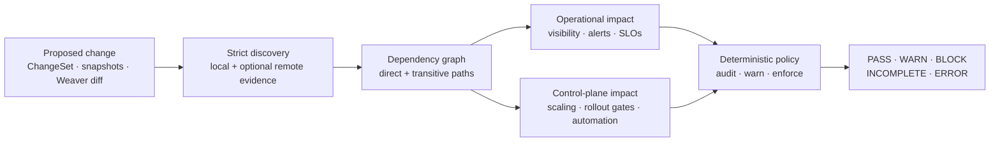
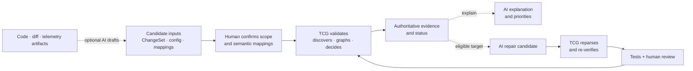

# Telemetry Change Guard

<p align="center">
  <strong>Stop telemetry contract changes from silently breaking production.</strong>
</p>

<p align="center">
  <a href="https://github.com/tadurisaikiran/telemetry-change-guard/actions/workflows/ci.yml"></a>
  <a href="https://github.com/tadurisaikiran/telemetry-change-guard/actions/workflows/e2e.yml"></a>
  <a href="LICENSE"></a>
  
  
</p>

<p align="center">
  <a href="#see-what-it-catches">Examples</a> ·
  <a href="#install">Install</a> ·
  <a href="#run-your-first-check">First check</a> ·
  <a href="#use-it-on-your-repository">Inputs and outputs</a> ·
  <a href="#what-telemetry-change-guard-protects">Coverage</a> ·
  <a href="#ai-assisted-telemetry-engineering">AI workflows</a> ·
  <a href="#github-action">GitHub Action</a> ·
  <a href="#documentation">Documentation</a>
</p>

Metrics, labels, span attributes, and resource attributes are operational APIs.
Dashboards visualize them. Alerts page on them. SLOs measure them. Autoscalers
and deployment gates can use them to control production.

Changing one may take a single line of code while breaking consumers spread
across repositories and systems. The application can compile, every test can
pass, and the deployment can succeed while an alert goes blind, an SLO stops
measuring the right behavior, or production automation acts on a broken signal.

That is the telemetry contract gap—and it grows as human and AI coding agents
change instrumentation faster than engineers can manually trace its downstream
blast radius.

**Telemetry Change Guard (TCG) finds that blast radius before merge or
deployment.** Give it an explicit ChangeSet, baseline and candidate Prometheus
snapshots, or a mapped OpenTelemetry Weaver diff. TCG discovers configured
consumers, follows direct and transitive dependencies, classifies operational
impact, and applies explicit policy.

The result is reviewable evidence, not a guess: the affected consumer, source
location, criticality, dependency path, policy reason, machine-readable report,
and one authoritative decision.

| Decision | What it means |
| --- | --- |
| `PASS` | No blocking impact was found under the configured evidence and policy |
| `WARN` | Risk exists, remains visible, and is permitted by the current policy |
| `BLOCK` | Complete evidence proves an enforced policy violation |
| `INCOMPLETE` | Required evidence is missing, malformed, dynamic, or unresolved |
| `ERROR` | The input, configuration, discovery, or evaluation failed safely |

For example, the included getting-started scenario proposes removing
`checkout_requests_total`. The application change is trivial, but a critical
Prometheus alert still queries the old metric. TCG identifies the exact rule
and source line, proves the dependency path, classifies `ALERTING_RISK`, and
returns `BLOCK` with exit code `2` before the change reaches production.



TCG is local-first, open source, and useful without AI, a database, or a hosted
service. Optional remote evidence and AI assistance are isolated behind
explicit, bounded interfaces; neither can override the deterministic result.

> **AI proposes. Humans approve. TCG verifies and decides.** AI can help read a
> change, explain evidence, draft a repair, or iterate inside the experimental
> isolated agentic loop. It can never create or override TCG's authoritative
> status. See [AI-assisted telemetry engineering](#ai-assisted-telemetry-engineering)
> and the [experimental agentic quickstart](experiments/agentic/README.md).

## See what it catches

Use TCG when you need to:

- review a proposed metric, label, span-attribute, or resource-attribute rename
  or removal before it merges;
- compare baseline and candidate Prometheus contracts and turn drift into a
  deterministic ChangeSet;
- plan a staged telemetry migration and prove when legacy signals can be
  removed;
- protect alerts, dashboards, SLOs, runtime queries, autoscalers, and rollout
  gates with one policy decision;
- add a reproducible telemetry-safety check to CI; or
- let AI help read, explain, or repair a change without letting model prose
  become the production-safety authority.

The repository includes runnable scenarios that exercise different parts of
that lifecycle, not just one adapter:

| Scenario | Proposed change | Dependency TCG proves | Result |
| --- | --- | --- | --- |
| [Observability migration](examples/checkout-migration) | Rename a Prometheus metric and label | Grafana panels, a Sloth SLO, a recording rule, and a transitive alert | `INCOMPLETE`: 7 findings, including blocking alert/SLO risk, plus one unresolved dashboard query |
| [KEDA autoscaling](examples/keda) | Remove a Prometheus metric | Production `ScaledObject` trigger | `BLOCK` with `SCALING_RISK` |
| [Argo Rollouts](examples/argo-rollouts) | Remove a Prometheus metric | `AnalysisTemplate` success-rate measurement | `BLOCK` with `DEPLOYMENT_GATE_RISK` |
| [Kubernetes HPA](examples/hpa) | Remove an external metric | Explicitly mapped `autoscaling/v2` HPA dependency | `BLOCK` with `SCALING_RISK` |
| [Snapshot detection](examples/snapshot-diff) | Compare baseline and candidate Prometheus contracts | Removed metrics and labels become an actionable ChangeSet | Deterministic full diff plus safety evaluation |

The observability fixture demonstrates why graph analysis matters. TCG follows
the full path instead of stopping at the first file:

```text
checkout_request_duration_seconds_bucket
  -> recording rule: checkout:p95_latency
  -> alert rule: CheckoutLatencyHigh
  -> ALERTING_RISK
```

When evidence is malformed or unresolved, TCG keeps every confirmed finding
and returns `INCOMPLETE`. It never turns an incomplete graph into a clean pass.

## Install

### Build the CLI from source

**Download status:** TCG does not yet publish packaged binaries, container
images, Homebrew packages, or a stable release tag. The current supported
installation path requires Git and Go 1.27 or newer:

```bash
git clone https://github.com/tadurisaikiran/telemetry-change-guard.git
cd telemetry-change-guard
mkdir -p ./bin
go build -trimpath -o ./bin/telemetry-change-guard ./cmd/telemetry-change-guard
./bin/telemetry-change-guard version
```

The resulting executable is `./bin/telemetry-change-guard`. Release binaries,
checksums, dual-format SBOMs, and provenance are now prepared and verified but
remain unpublished pending explicit owner approval. See the
[release procedure](docs/RELEASING.md), [verification guide](docs/VERIFY_RELEASE.md),
and [issue #29](https://github.com/tadurisaikiran/telemetry-change-guard/issues/29).
Do not download an unofficial binary or use a nonexistent `v1` tag.

### Use the GitHub Action

If TCG will run only in GitHub Actions, no local installation is required. The
composite Action builds and runs the canonical CLI inside the job. Use the
exact verified commit in the [GitHub Action example](#github-action); a stable
release coordinate does not exist yet.

## Run your first check

The minimal [getting-started example](examples/getting-started) contains the
three inputs involved in a normal check:

| File | Purpose |
| --- | --- |
| [`changes.yaml`](examples/getting-started/changes.yaml) | Declares that `checkout_requests_total` will be removed |
| [`tcg.yaml`](examples/getting-started/tcg.yaml) | Tells TCG which consumer files to inspect and which policy to enforce |
| [`prometheus/rules.yaml`](examples/getting-started/prometheus/rules.yaml) | Contains a critical alert that still queries the metric |

```text
changes.yaml       what will change
tcg.yaml           where to look and how to decide
Prometheus rules   what currently depends on the telemetry
       \                 |                 /
        +----------------+----------------+
                         |
             telemetry-change-guard check
                         |
              status + findings + exit code
```

From the repository root, build the CLI as shown above, then validate and
check the example:

```bash
./bin/telemetry-change-guard validate \
  --changes ./examples/getting-started/changes.yaml

./bin/telemetry-change-guard check \
  --config ./examples/getting-started/tcg.yaml \
  --changes ./examples/getting-started/changes.yaml
```

Validation exits `0`. The check intentionally exits `2` because removing the
metric would break a critical alert. The essential console output is:

```text
Status:    BLOCK
Findings:  1

[BLOCK] ALERTING_RISK — CheckoutTrafficMissing
  Change:      remove-checkout-requests
  Consumer:    ... (alert_rule)
  Criticality: critical
  Source:      examples/getting-started/prometheus/rules.yaml:4
  Path:        checkout_requests_total -> CheckoutTrafficMissing
  Policy:      block policy for ALERTING_RISK

STATUS: BLOCK
```

Exit `2` means TCG ran successfully and policy rejected the proposed change;
it is not a tool crash. The report identifies the affected consumer, its
operational impact, criticality, source location, dependency path, and policy
decision.

## Use it on your repository

A safety check always needs the proposed change and the evidence to compare it
against:

| Input | Required? | What to provide |
| --- | --- | --- |
| Product configuration | Always | `--config ./tcg.yaml`, pointing to the consumer artifacts and evidence sources TCG should inspect |
| Change source | Exactly one | An explicit ChangeSet, a baseline/candidate snapshot pair, or a Weaver diff with an explicit backend mapping |
| Consumer artifacts | As configured | Prometheus rules, Grafana dashboards, SLOs, KEDA resources, Argo Rollouts templates, or explicitly mapped HPA resources |
| Additional evidence | Optional | Runtime query history, Perses usage, Tempo-validated TraceQL queries, and ownership metadata |

### 1. Describe the proposed change

Create `changes.yaml`. This example removes one Prometheus metric:

```yaml
apiVersion: tcg/v1alpha1
kind: ChangeSet
metadata:
  name: checkout-metric-removal
spec:
  changes:
    - id: remove-checkout-requests
      kind: metric_remove
      domain: prometheus
      from:
        domain: prometheus
        kind: metric
        name: checkout_requests_total
```

TCG supports metric, label, span-attribute, and resource-attribute renames and
removals in their documented domains. See the
[ChangeSet schema](docs/CHANGESET.md) for every accepted shape.

### 2. Point TCG to consumers

Create `tcg.yaml` with the sources that are authoritative for your repository:

```yaml
apiVersion: tcg/v1alpha1
kind: Config
sources:
  prometheusRules:
    - path: ./monitoring/*.yaml
      required: true
  grafana:
    - path: ./dashboards/*.json
      required: true
  sloth:
    - path: ./slos/*.yaml
      required: true
analysis:
  includeTransitiveDependencies: true
  unresolvedReferencePolicy: error
policy:
  failOnCriticalLegacyConsumer: true
  failOnCriticalUnknown: true
  minimumBlockingCriticality: high
output:
  formats: [console, json, markdown]
```

Start with sources your repository actually owns. Mark a source `required`
when its absence must prevent a safety decision. Missing or malformed required
evidence returns `INCOMPLETE` or `ERROR`; it is never treated as an empty safe
result. See the [configuration guide](docs/CONFIGURATION.md).

### 3. Run one authoritative evaluation

```bash
./bin/telemetry-change-guard check \
  --config ./tcg.yaml \
  --changes ./changes.yaml \
  --mode enforce \
  --format console \
  --json-output ./tcg-result.json
```

This prints the human-readable report and writes the versioned machine result
from the same evaluation. No discovery source is queried twice.

The `check` command accepts exactly one change source:

| Workflow | Arguments |
| --- | --- |
| Explicit ChangeSet | `--changes ./changes.yaml` |
| Prometheus snapshot comparison | `--baseline ./main.json --candidate ./candidate.json` |
| OpenTelemetry Weaver diff | `--weaver-diff ./diff.json --weaver-mapping ./mapping.yaml` |

Partial pairs, multiple change sources, a missing configuration, or no change
source fail as input errors instead of being guessed. Planned migrations use a
separate compatibility workflow:

```bash
./bin/telemetry-change-guard migration check \
  --config ./tcg.yaml \
  --plan ./migration.yaml
```

### 4. Interpret the result

| Status | Exit | Meaning | Typical next action |
| --- | ---: | --- | --- |
| `PASS` | `0` | Analysis completed with no remaining finding or diagnostic | Proceed under normal review |
| `WARN` | `0` | Findings exist, but current policy permits the change | Review and migrate affected consumers when appropriate |
| `BLOCK` | `2` | Complete evidence proves an enforced policy violation | Migrate the named consumers or make an explicit policy decision |
| `INCOMPLETE` | `3` | Required evidence is missing, malformed, dynamic, or unresolved | Fix the source, mapping, or query before deciding |
| `ERROR` | `1` | Configuration, input, tool, or policy evaluation failed | Correct the reported error and rerun |

Findings are never removed merely because a higher-precedence `INCOMPLETE` or
`ERROR` exists. Review the findings and diagnostics together.

### 5. Choose an output

| Need | Command option |
| --- | --- |
| Human-readable terminal report | `--format console` |
| Versioned machine result | `--format json --output ./tcg-result.json` |
| Markdown report | `--format markdown --output ./tcg-report.md` |
| Console or Markdown plus companion JSON | `--json-output ./tcg-result.json` |
| Status-only integration file | `--status-output ./tcg-status.txt` |
| Complete dependency graph | `./bin/telemetry-change-guard graph --config ./tcg.yaml --output ./graph.json` |

Use distinct paths for `--output`, `--json-output`, and `--status-output`.
Machine consumers should use the versioned JSON and authoritative status—not
parse console prose. The JSON result contains the normalized ChangeSet,
authoritative status, findings, and policy decisions, plus discovery
diagnostics and evaluation errors when present, under the
`tcg-result/v1alpha1` schema. The
[CLI guide](docs/CLI.md) documents all commands, rollout modes, and exit
contracts.

## What Telemetry Change Guard protects

TCG separates four questions: what changed, what consumes it, what the impact
is, and whether policy permits it. That separation makes the result auditable
and lets new evidence adapters improve coverage without becoming decision
makers.

### Change sources and contracts

Every supported source normalizes to the same strict
[`tcg/v1alpha1` ChangeSet](docs/CHANGESET.md) before analysis.

| Capability | Implemented behavior |
| --- | --- |
| Explicit changes | Metric and label rename/removal in Prometheus; span and resource attribute rename/removal in OpenTelemetry or Tempo |
| Prometheus snapshots | Bounded, byte-stable metadata/series capture; baseline/candidate comparison; full versioned diff; removed metrics and labels become changes |
| OpenTelemetry Weaver | Structured V1/V2 registry-diff import with mandatory explicit Prometheus mappings or documented ignore decisions |
| Planned migrations | Legacy migration plans normalize into the generic model while preserving the existing readiness result contract |
| Strict input handling | Unknown fields, extra documents, unsupported kinds, invalid endpoints, oversized input, and ambiguous required semantics fail explicitly |

Snapshot additions remain visible but are not treated as breaking changes.
Metric type or unit drift is reported as required uncertainty until the
ChangeSet model can represent it without guessing. See
[change sources and snapshots](docs/CHANGE_SOURCES.md) and the
[migration model](docs/MIGRATION_MODEL.md).

### Consumers and evidence

| Source | What TCG discovers | Evidence behavior |
| --- | --- | --- |
| Prometheus rules and `PrometheusRule` CRDs | Alert and recording rules | Official PromQL AST; recording-rule outputs create transitive graph edges |
| Grafana dashboard JSON | Prometheus panel queries | Nested panels and API envelopes; unresolved templates stay visible |
| Sloth and Pyrra | SLO indicator queries | Critical SLO dependencies, parsed as PromQL |
| KEDA | Prometheus triggers in `ScaledObject` resources | Autoscaler consumers and production-aware `SCALING_RISK` |
| Argo Rollouts | Prometheus measurements in `AnalysisTemplate` and `ClusterAnalysisTemplate` resources | Deployment-gate consumers; only AST-proven label-value argument substitution is accepted |
| Kubernetes HPA | External, object, and pods metrics in `autoscaling/v2` resources | Requires an explicit Kubernetes-to-Prometheus metric and selector-label mapping; same-name inference is forbidden |
| Runtime query history | Prometheus query-log JSONL and a versioned provider-neutral history format | Deterministic aggregation and observation windows; absence never proves non-use |
| Perses metrics-usage | Dashboard, alert-rule, recording-rule, partial, and pending usage | Optional bounded HTTP evidence; imported expressions are parsed again locally |
| Tempo and TraceQL | Strict local trace-query inventories | Tempo validates syntax; scoped span/resource attributes require explicit OpenTelemetry mappings |
| Ownership metadata | Explicit repository metadata, GitHub CODEOWNERS, and Grafana `team:`/`owner:` tags | Advisory owner enrichment with provenance; never changes status |

Local sources require no network. Perses and Tempo are opt-in, read-only remote
adapters with response limits, timeouts, same-origin redirect checks, and
environment-variable credential references. Adapter failures and partial
evidence remain diagnostics; a failed required source cannot produce `PASS` or
`READY`. The [adapter catalog](docs/ADAPTERS.md) documents exact boundaries.

### Graph, impact, and policy

| Capability | What it provides |
| --- | --- |
| Formal query analysis | Prometheus's official PromQL parser for selectors, matchers, aggregations, vector matching, and label functions; Tempo parser validation for TraceQL |
| Dependency graph | Direct and cycle-safe transitive paths through produced symbols such as recording rules |
| Operational taxonomy | `VISIBILITY_LOSS`, `ALERTING_RISK`, `SLO_RISK`, `SCALING_RISK`, `DEPLOYMENT_GATE_RISK`, `AUTOMATION_RISK`, and `SEMANTIC_RISK` |
| Immutable findings | Change, consumer, criticality, source location, references, provenance, and dependency paths are retained before policy runs |
| Rollout modes | `audit`, `warn`, and `enforce` change handling without deleting or hiding findings |
| Fail-closed precedence | `ERROR` → `INCOMPLETE` → `BLOCK` → `WARN` → `PASS`; known findings survive higher-precedence uncertainty or errors |
| Machine contract | Versioned `tcg-result/v1alpha1` JSON with stable status and exit-code semantics |

The default enforcement policy warns on visibility and semantic findings and
blocks high/critical alerting, SLO, scaling, deployment-gate, and automation
risk. Teams can stage adoption with rollout modes and criticality thresholds
without losing evidence. See the [generic safety engine](docs/SAFETY_ENGINE.md).

### CLI and automation

The canonical executable is `telemetry-change-guard`. Its main workflows are:

```text
telemetry-change-guard validate          validate ChangeSets or snapshots
telemetry-change-guard snapshot          capture a bounded Prometheus contract
telemetry-change-guard diff              compare baseline/candidate snapshots
telemetry-change-guard check             make an authoritative safety decision
telemetry-change-guard impact            explain paths from one Prometheus metric
telemetry-change-guard graph             export the complete dependency graph
telemetry-change-guard migration check   evaluate planned cutover readiness
telemetry-change-guard migration advise  request a bounded optional AI explanation
telemetry-change-guard migration remediate validate an in-memory candidate fix
```

Reports are available as console, Markdown, versioned JSON, and graph JSON.
One evaluation can also write companion JSON and authoritative status files,
so integrations never need to rediscover remote evidence or infer a status
from prose. The [CLI reference](docs/CLI.md) covers every flag and exit code.

The temporary `tmr` compatibility executable and `tmr/v1alpha1`
configuration remain supported. They share the canonical command
implementation; equivalent migration checks produce byte-for-byte identical
legacy reports and the same `READY`/`BLOCKED`/`INCOMPLETE`/`ERROR` exit
contract.

## AI-assisted telemetry engineering

**AI can be the reader, explainer, fixer, and migration assistant—never the
judge. Humans approve. TCG verifies and decides.**

This division is deliberate. Models are useful for interpreting unfamiliar
code, normalizing information, explaining evidence, and drafting repetitive
repairs. They are not reliable authorities for proving that every dependency
was discovered or that a production change is safe. TCG keeps discovery,
dependency analysis, impact classification, policy, status, and exit codes
deterministic.

| AI role | Availability | What it can do | Authority boundary |
| --- | --- | --- | --- |
| **Change reader** | External AI or coding-agent workflow | Inspect code, instrumentation, or a diff and draft a candidate ChangeSet, snapshot, configuration, mapping, or ownership file | TCG validates accepted structure, not discovery completeness; a human confirms scope and semantic mappings |
| **Risk explainer** | Built in with `migration advise` | Explain blockers and dependency paths, identify missing evidence, and prioritize consumers | Receives a bounded, redacted evidence packet; its prose cannot change a finding, status, or exit code |
| **Fixer** | Built in with `migration remediate` | Draft replacement PromQL for eligible direct rename targets in local Prometheus rule YAML or exported Grafana JSON | TCG accepts an expression candidate, reparses and reanalyzes it in memory, and never edits the source file or claims semantic equivalence |
| **Repair-loop adapter** | Experimental `experiments/agentic` MVP | Edit one isolated workspace, receive deterministic `BLOCK` feedback, and retry against the actual edited tree | A hardened container and bounded controller produce only an uncommitted review diff; they never approve, commit, push, open, or merge a change request |
| **Test, runbook, and review assistant** | External AI workflow | Draft tests, migration steps, tickets, change-request text, or evidence summaries | Generated material remains a candidate and must preserve the authoritative TCG result |

An AI assistant can normalize only the code and telemetry evidence it can
observe. Neither a model nor `validate` can certify that a partial observation
contains every telemetry change or downstream dependency. Prefer TCG-captured
snapshots or explicitly mapped Weaver diffs when deterministic sources are
available.



### Use AI to draft inputs

An external assistant can draft candidate files, but the strict public
validators must receive them before analysis:

```bash
./bin/telemetry-change-guard validate --changes ./candidate-changes.yaml
./bin/telemetry-change-guard validate --config ./candidate-tcg.yaml

./bin/telemetry-change-guard check \
  --config ./candidate-tcg.yaml \
  --changes ./candidate-changes.yaml
```

Unknown fields, invalid symbols, unsupported change kinds, malformed mappings,
and ambiguous source combinations fail explicitly. Successful validation means
the file is structurally acceptable; it does not prove that the AI found every
change.

### Ask AI to explain or draft a bounded repair

For planned migrations, TCG can invoke a user-selected provider executable
through a vendor-neutral JSON process protocol:

```bash
./bin/telemetry-change-guard migration advise \
  --config ./tcg.yaml \
  --plan ./migration.yaml \
  --question "Why is this blocked, what evidence is missing, and what should we migrate first?" \
  --ai-command ./my-tcg-ai-provider

./bin/telemetry-change-guard migration remediate \
  --config ./tcg.yaml \
  --plan ./migration.yaml \
  --ai-command ./my-tcg-ai-provider
```

No model SDK, hosted model, or provider account is bundled. The executable runs
only when explicitly selected and may use a local model or a remote service
approved by the user's organization. Review the provider's access, retention,
training, and confidentiality terms before sending sensitive operational
evidence.

### Try the experimental isolated repair loop

The optional agentic MVP demonstrates a bounded
`agent attempt -> TCG decision -> repair -> recheck -> human review` lifecycle.
The adapter runs by immutable image ID with a read-only container filesystem,
no capabilities, no network by default, resource limits, and exactly one
writable workspace mount. TCG policy, evidence, executable, controller, and
previous artifacts remain outside that mount. Control files and the TCG
executable are integrity-checked throughout the run.

`PASS` or visible `WARN` produces `REVIEW_READY` and an uncommitted diff.
`BLOCK` can retry at most three times. `INCOMPLETE`, `ERROR`, timeout, malformed
output, tampering, workspace escape, or exhausted retries stop safely.

> **Experimental—not a supported production feature.** Start with the
> [five-minute fixture and adapter protocol](experiments/agentic/README.md).
> Controlled comparison and external design-user work remain tracked in
> [issue #40](https://github.com/tadurisaikiran/telemetry-change-guard/issues/40)
> and [issue #41](https://github.com/tadurisaikiran/telemetry-change-guard/issues/41).

Read the [complete AI workflow guide](docs/AI_WORKFLOWS.md),
[explanation protocol](docs/AI_AGENT.md),
[validated remediation contract](docs/REMEDIATION.md),
[agentic roadmap](docs/AGENTIC_ROADMAP.md), and
[threat model](docs/THREAT_MODEL.md) before enabling a provider in a sensitive
repository.

## GitHub Action

Add the same deterministic decision to a pull request:

```yaml
permissions:
  contents: read
  pull-requests: write

steps:
  - uses: actions/checkout@3d3c42e5aac5ba805825da76410c181273ba90b1 # v7.0.1
  - id: telemetry
    uses: tadurisaikiran/telemetry-change-guard@7a26f5db60becf9a09010f98944787a6ab15bdff
    with:
      config: tcg.yaml
      changes: changes.yaml
      remote-evidence: disabled
```

The Action records its CLI build identity, performs one authoritative
evaluation, appends the Markdown analysis to the job summary, uploads the
versioned JSON evidence artifact, creates or updates one bounded pull-request
comment, and finally enforces the exact CLI exit code.
Missing artifacts, invalid source combinations, and status/exit disagreement
fail closed.

Replace `changes` with a complete `baseline`/`candidate` snapshot pair or a
`weaver-diff`/`weaver-mapping` pair. Use `migration: migration.yaml` for the
compatibility workflow.

The canonical repository does not yet publish a stable release or `v1` tag.
Pin the exact fully verified commit above; **do not use `@v1`**. Signed
pre-release binaries, checksums, SBOM/provenance, and the immutable release
Action coordinate are tracked in
[issue #29](https://github.com/tadurisaikiran/telemetry-change-guard/issues/29).
See the [Action guide](docs/GITHUB_ACTION.md) for all inputs, outputs,
artifacts, and permission choices. Read [Secure CI usage](docs/SECURE_CI_USAGE.md)
before enabling a remote adapter or exposing a credential.

## Trust and safety model

TCG is designed for a particularly dangerous failure mode: mistaking missing
evidence for evidence of safety.

- **Deterministic authority.** Discovery, graph traversal, impact
  classification, policy, and process exit codes do not depend on an LLM.
- **Formal parsing.** PromQL uses Prometheus's official typed AST. TraceQL is
  accepted only after configured Tempo validation. Regex and name similarity
  do not establish dependencies.
- **Explicit domain boundaries.** Prometheus, OpenTelemetry, and Tempo symbols
  remain separate unless mapping evidence connects them.
- **Fail-closed evidence.** Required load, parse, mapping, or expansion failure
  produces `INCOMPLETE` or `ERROR`, never an empty success.
- **Auditable findings.** Results preserve file, line, expression, extraction
  method, confidence, owner, and dependency path where available.
- **Bounded untrusted input.** Files, records, expressions, responses,
  redirects, timeouts, provider output, and credential handling have explicit
  limits.
- **Local-first execution.** The core does not phone home, execute analyzed
  queries, or require persistence. Network access exists only for configured
  remote adapters.

The test suite includes strict decoders, golden machine results, AST analysis,
cycle and transitive graph cases, status truth tables, fuzzing, adversarial AI
protocol tests, source immutability checks, hosted Action smoke tests, and
pinned live lifecycles against Prometheus, Grafana, Sloth, Tempo, KEDA, Argo
Rollouts, and HPA. See [testing and verification](docs/TESTING.md).

## Project status and honest boundaries

TCG is pre-release software. The implemented product is useful today for the
supported inputs and consumers, but several boundaries are intentional and
important:

- There is no stable release or `v1` Action tag yet; build from source or pin
  the documented verified commit.
- The public tool does not infer arbitrary source-code diffs. Use an explicit
  ChangeSet, a bounded snapshot pair, or an explicitly mapped Weaver diff.
- Snapshot evidence describes what the queried Prometheus deployment exposed;
  it does not prove every signal an application can emit.
- Runtime query history is additive evidence. An empty history never proves a
  metric is unused.
- Similar names across telemetry or infrastructure domains never imply a
  mapping.
- Synthesized CloudFormation JSON and Cloud Assemblies have a strict, bounded,
  non-executing loader. CloudFormation intrinsic resolution and CloudWatch
  consumer safety decisions are **not** implemented or exposed as an analysis
  source yet. See the [AWS boundary](docs/AWS.md).
- LogQL, Collector configuration discovery, MCP, and server/UI modes remain
  roadmap work.

This candor is part of the safety contract: unsupported or unresolved required
evidence must be visible as incomplete, not marketed as coverage.

## Choose your next step

- **Five-minute evaluation:** begin with [getting started](examples/getting-started),
  then try the [KEDA](examples/keda), [Argo Rollouts](examples/argo-rollouts),
  [HPA](examples/hpa), or [snapshot](examples/snapshot-diff) fixture.
- **Real repository evaluation:** follow the
  [design-user program](docs/DESIGN_USER_PROGRAM.md) for planned migration,
  proposed-change, and control-plane workflows using sanitized evidence.
- **Required CI check:** use the [GitHub Action](docs/GITHUB_ACTION.md) after
  agreeing which evidence is required and which critical risks must block.
- **Understand the problem:** read
  [When Telemetry Migrations Fail Silently](docs/articles/when-telemetry-migrations-fail-silently.md).
- **Contribute:** review the [roadmap](docs/ROADMAP.md),
  [related work](RELATED_WORK.md), and [contribution guide](CONTRIBUTING.md).

Organizations publicly using TCG may opt in through the documented process in
[ADOPTERS.md](ADOPTERS.md). Private evaluation never becomes a public adopter
claim without authorization.

## Documentation

| Goal | Guide |
| --- | --- |
| Understand the system | [Architecture](docs/ARCHITECTURE.md) · [Safety engine](docs/SAFETY_ENGINE.md) · [Threat model](docs/THREAT_MODEL.md) |
| Define inputs | [ChangeSet](docs/CHANGESET.md) · [Change sources and snapshots](docs/CHANGE_SOURCES.md) · [Migration model](docs/MIGRATION_MODEL.md) · [Configuration](docs/CONFIGURATION.md) |
| Run locally or in CI | [CLI](docs/CLI.md) · [GitHub Action](docs/GITHUB_ACTION.md) · [Secure CI usage](docs/SECURE_CI_USAGE.md) · [Testing](docs/TESTING.md) |
| Understand versions and upgrades | [Changelog](CHANGELOG.md) · [Versioning](docs/VERSIONING.md) · [Compatibility](docs/COMPATIBILITY.md) · [Upgrading](docs/UPGRADING.md) |
| Rehearse or verify a release | [Release procedure](docs/RELEASING.md) · [Artifact and provenance verification](docs/VERIFY_RELEASE.md) |
| Configure local consumers | [Prometheus/Grafana/SLO adapters](docs/ADAPTERS.md) · [KEDA](docs/KEDA.md) · [Argo Rollouts](docs/ARGO_ROLLOUTS.md) · [HPA](docs/HPA.md) |
| Add change or usage evidence | [Weaver](docs/WEAVER.md) · [Perses](docs/PERSES.md) · [Runtime queries](docs/RUNTIME_EVIDENCE.md) · [Tempo/TraceQL](docs/TEMPO.md) |
| Add human and AI context | [Ownership](docs/OWNERSHIP.md) · [AI workflows](docs/AI_WORKFLOWS.md) · [Agentic roadmap](docs/AGENTIC_ROADMAP.md) · [AI explanations](docs/AI_AGENT.md) · [Candidate remediation](docs/REMEDIATION.md) |
| Evaluate maturity | [Design-user program](docs/DESIGN_USER_PROGRAM.md) · [Roadmap](docs/ROADMAP.md) · [Related work](RELATED_WORK.md) · [AWS boundary](docs/AWS.md) |

## Development

```bash
make verify
```

Docker is required only for the live E2E suites. Contributions that affect
discovery, graph traversal, or policy need tests proving both safe and unsafe
directions. Read [CONTRIBUTING.md](CONTRIBUTING.md),
[GOVERNANCE.md](GOVERNANCE.md), and the [security policy](SECURITY.md) before
submitting changes or reporting vulnerabilities.

## License

Apache License 2.0. See [LICENSE](LICENSE).
