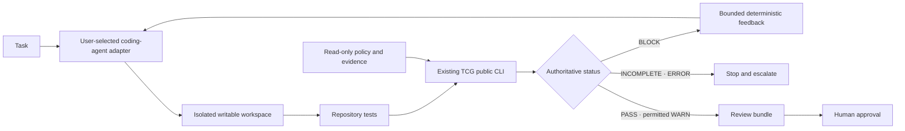

# Optional agentic layer roadmap

## Decision

Telemetry Change Guard will preserve and harden its existing deterministic
product while developing an optional agentic layer as an isolated experiment.
The agentic work is additive: it consumes the public CLI and versioned result
artifacts instead of replacing or bypassing them.

The near-term work therefore has two lanes:

1. **Existing product:** finish honest release packaging, onboarding, design-user
   evaluation, and correctness measurement.
2. **Optional agentic experiment:** prove a bounded
   `agent attempt -> TCG decision -> repair -> recheck -> human review` loop.

The experimental work may proceed in parallel, but it must not delay a core
release, change existing contracts, or be marketed as shipped functionality.

## What exists and what is planned

| Capability | Status |
| --- | --- |
| Deterministic discovery, graph analysis, policy, findings, status, and exit codes | Implemented |
| Versioned JSON, companion status output, CLI, and GitHub Action | Implemented |
| Bounded AI explanation through `migration advise` | Implemented and optional |
| In-memory validated expression candidates through `migration remediate` | Implemented and optional |
| External coding agent manually consuming TCG output | Possible through external orchestration, not a TCG feature |
| Provider-neutral agent runner, isolated workspace, repair controller, and review bundle | Planned in [issue #39](https://github.com/tadurisaikiran/telemetry-change-guard/issues/39) |
| Comparative agent benchmark | Planned in [issue #40](https://github.com/tadurisaikiran/telemetry-change-guard/issues/40) |
| Supported design-user agent workflow | Planned only after evidence, in [issue #41](https://github.com/tadurisaikiran/telemetry-change-guard/issues/41) |
| AI source/diff scanning and candidate ChangeSet extraction | Not implemented; separate later work in [issue #42](https://github.com/tadurisaikiran/telemetry-change-guard/issues/42) |
| Autonomous approval, merge, or production mutation | Not planned |

## Architecture boundary

The coding agent is an untrusted proposer. It must run inside an enforceable OS
sandbox or container that exposes only its assigned workspace as writable; a
Git worktree alone is organization, not a security boundary. The agent cannot
modify the TCG binary, configuration, downstream evidence, hidden oracle
tests, previous result artifacts, or the controller. `INCOMPLETE` and `ERROR`
stop the loop. `BLOCK` may trigger only a bounded number of repair attempts. A
successful check advances to review, never directly to merge.

## MVP scope

The MVP belongs under `experiments/agentic/` until promotion criteria are met.
It should:

- invoke a provider-neutral agent executable directly, without a command
  shell;
- use strict, versioned and bounded process schemas;
- create a fresh Git worktree or equivalent workspace per run inside an
  enforceable sandbox or container, with policy and evidence outside its
  writable mounts;
- invoke the public `telemetry-change-guard` executable rather than importing
  internal packages;
- consume versioned JSON, authoritative status output, and exact exit codes;
- implement explicit `PASS`/`WARN`/`BLOCK`/`INCOMPLETE`/`ERROR` transitions;
- return only bounded deterministic findings and diagnostics for a repair;
- default to at most three attempts, with time, output, and cancellation
  limits;
- record task, tool, adapter, configuration/evidence hashes, attempts,
  durations, results, and final uncommitted diff; and
- demonstrate a local synthetic `BLOCK -> repair -> PASS` lifecycle plus
  tamper, timeout, malformed-response, incomplete-evidence, and error cases.

The MVP does not scan arbitrary source code, install a model SDK, open a pull
request, push a branch, merge, call production APIs, or alter TCG policy.

## Existing product work remains necessary

The agentic layer does not solve current distribution and adoption gaps. Before
promoting it as an easy external workflow, TCG still needs:

1. A signed, reproducible pre-release and immutable Action coordinate
   ([issue #29](https://github.com/tadurisaikiran/telemetry-change-guard/issues/29)).
2. A sanitized, copy-paste design-user fixture pack
   ([issue #32](https://github.com/tadurisaikiran/telemetry-change-guard/issues/32)).
3. Independent evaluations of the existing deterministic workflows
   ([issue #30](https://github.com/tadurisaikiran/telemetry-change-guard/issues/30)).
4. A licensed correctness and performance corpus
   ([issue #31](https://github.com/tadurisaikiran/telemetry-change-guard/issues/31)).

The non-failing local Action cache annotation in
[issue #35](https://github.com/tadurisaikiran/telemetry-change-guard/issues/35)
should be corrected but does not block the isolated MVP. The incomplete AWS
workstream is independent and is not a prerequisite for Prometheus-based
agentic evaluation.

## Evaluation and promotion gates

The experimental layer may become a preview only after all of these are true:

- policy and evidence cannot be modified through the agent workspace;
- timeout, cancellation, malformed output, retry exhaustion, `INCOMPLETE`, and
  `ERROR` all fail safely;
- the final check evaluates the actual edited artifacts rather than an earlier
  simulation;
- the benchmark uses ground truth independent of TCG and reports unfavorable
  as well as favorable results;
- comparisons cover no guard, LLM self-review, a defined conventional check,
  and TCG with structured feedback;
- independent design users complete the synthetic workflow without repository
  administration, production, or merge permissions;
- documentation covers provider trust, prompt injection, source
  confidentiality, data retention, cost, and recovery; and
- existing CLI, Action, schemas, decisions, and AI-disabled local behavior
  remain compatible.

A preview does not automatically become a supported product. Support requires
an explicit versioning, maintenance, threat-model, and compatibility decision
based on the evaluation evidence.

## Sharing strategy

The existing public CLI and GitHub Action remain the primary introduction for
SRE, platform, and observability engineers. The experimental agentic layer
should initially be shared as:

1. a five-minute synthetic local example;
2. a short recorded `BLOCK -> repair -> PASS -> review` demonstration;
3. a reproducible benchmark and raw non-proprietary results; and
4. an opt-in design-user evaluation using synthetic or authorized sanitized
   repositories.

External evaluations must not request proprietary manifests, production
credentials, employer-confidential data, or permission to merge. Public
availability is not evidence of adoption; adopter claims continue to require
the explicit consent process in [`ADOPTERS.md`](../ADOPTERS.md).
